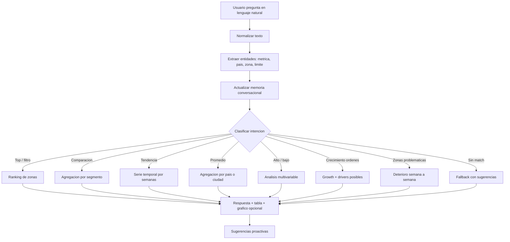

# Analisis Tecnico

## Alcance

La solucion cubre los dos entregables principales del caso tecnico:

1. Bot conversacional de datos para que usuarios no tecnicos consulten metricas
   operacionales en lenguaje natural.
2. Sistema automatico de insights que produce un reporte ejecutivo estructurado.

El agente responde los casos obligatorios: filtros top N, comparaciones por
segmento, tendencias temporales, agregaciones por pais, combinaciones
multivariable e inferencias de crecimiento en ordenes. Tambien interpreta
"zonas problematicas" como deterioros relevantes en metricas clave.

Quedan fuera del alcance productivo: autenticacion, despliegue cloud, envio
automatico por email y gobierno de permisos por usuario.

## Tecnologias

- Python 3.12: lenguaje principal.
- pandas: carga, normalizacion y analisis tabular.
- openpyxl: lectura del workbook Excel provisto.
- Plotly: graficos para tendencias, comparaciones y rankings.
- Streamlit: interfaz web local para demo en vivo.
- pytest: pruebas de regresion de las consultas principales.
- Ruff: linting y validacion PEP8.

No se usa LLM externo en la version entregada. La decision reduce costo,
latencia y riesgo de respuestas no reproducibles para una prueba tecnica con
preguntas conocidas. El diseno permite reemplazar el `QueryEngine` por un
planificador LLM en una iteracion posterior.

## Decisiones Tomadas

- Motor deterministico sobre pandas: prioriza precision verificable y demo
  estable frente a generacion libre.
- Normalizacion wide + long: la tabla wide simplifica calculos por semana y la
  long facilita graficos y extensiones analiticas.
- Memoria conversacional ligera: se guardan ultima metrica, pais, zona e
  intencion para follow-ups sin introducir una base de datos.
- Insights explicables: cada hallazgo incluye categoria, severidad, detalle,
  evidencia y recomendacion accionable.
- Reporte Markdown y HTML: Markdown es versionable y HTML es util para
  presentacion ejecutiva.
- Sin APIs pagas: costo estimado por sesion local de `0 USD`.

## Logica del Agente

## Modulos

- `rappi_intelligence.config`: constantes de paths, hojas, columnas semanales,
  metricas positivas/negativas y aliases de metricas.
- `rappi_intelligence.models`: dataclasses de dominio (`AnalyticsDataset`,
  `AgentResponse`, `Insight`).
- `rappi_intelligence.data_loader`: deteccion del Excel, lectura de hojas,
  validacion de esquema, normalizacion de columnas y conversion wide-to-long.
- `rappi_intelligence.query_engine`: motor conversacional deterministico. Extrae
  entidades, clasifica intenciones y ejecuta analisis pandas.
- `rappi_intelligence.agent`: fachada stateful que expone `ask()` y preguntas
  iniciales para la interfaz.
- `rappi_intelligence.insights`: generador de anomalias, tendencias
  preocupantes, benchmarking, correlaciones y oportunidades.
- `rappi_intelligence.reporting`: render de reportes Markdown/HTML.
- `rappi_intelligence.cli`: interfaz de linea de comandos para demo, preguntas
  puntuales y generacion de reportes.
- `streamlit_app.py`: interfaz web local para demo en vivo.

## Criterios de Insight

- Anomalias: cambio semana a semana mayor a 10%.
- Tendencias preocupantes: tres semanas consecutivas de deterioro.
- Benchmarking: brecha mayor a 20% contra zonas del mismo pais y tipo.
- Correlaciones: correlacion absoluta mayor a 0.45 entre metricas actuales.
- Oportunidades: alto volumen de ordenes combinado con bajo Lead Penetration.

## Limitaciones y Proximos Pasos

- Agregar una capa LLM opcional para preguntas fuera de patrones conocidos,
  manteniendo pandas como herramienta de ejecucion.
- Incorporar permisos por pais/equipo y auditoria de consultas.
- Agregar exportacion CSV/PDF desde Streamlit.
- Enriquecer explicaciones causales con datos externos: promociones, supply,
  incidentes, clima o calendarios comerciales.
- Automatizar envio de reportes por email o Slack.
