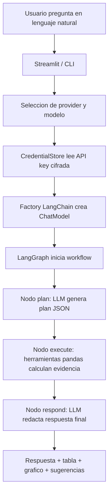

# Analisis Tecnico

## Alcance

La solucion cubre los dos entregables principales del caso tecnico:

1. Bot conversacional de datos para que usuarios no tecnicos consulten metricas
   operacionales en lenguaje natural.
2. Sistema automatico de insights que produce un reporte ejecutivo estructurado.

El agente usa LangGraph y un provider LLM seleccionable para interpretar y
redactar respuestas. Los calculos quedan en herramientas pandas para mantener
trazabilidad. Responde los casos obligatorios: filtros top N, comparaciones por
segmento, tendencias temporales, agregaciones por pais, combinaciones
multivariable e inferencias de crecimiento en ordenes. Tambien interpreta
"zonas problematicas" como deterioros relevantes en metricas clave.

Quedan fuera del alcance productivo: autenticacion, despliegue cloud, envio
automatico por email y gobierno de permisos por usuario.

## Tecnologias

- Python 3.12: lenguaje principal.
- pandas: carga, normalizacion y analisis tabular.
- openpyxl: lectura del workbook Excel provisto.
- LangGraph: orquestacion del flujo planificar, ejecutar y responder.
- LangChain providers: OpenAI, Anthropic, Gemini y Ollama.
- cryptography/Fernet: cifrado simetrico de API keys.
- SQLite: almacenamiento local de credenciales cifradas.
- Plotly: graficos para tendencias, comparaciones y rankings.
- Streamlit: interfaz web local para demo en vivo.
- pytest: pruebas de regresion de las consultas principales.
- Ruff: linting y validacion PEP8.

Providers soportados:

- `openai`: via `langchain-openai`.
- `anthropic`: via `langchain-anthropic`.
- `gemini`: via `langchain-google-genai`.
- `ollama`: via `langchain-ollama`; soporta modo local
  (`http://localhost:11434`) y modo cloud (`https://ollama.com`) con header
  `Authorization: Bearer <token>`.

## Decisiones Tomadas

- LangGraph como capa de agente: separa planificacion, ejecucion y redaccion.
- LLM configurable: permite elegir provider/modelo segun costo, latencia o
  disponibilidad.
- Ollama dual: puede correr contra una instancia local sin API key o contra
  Ollama Cloud con token cifrado.
- Pandas como fuente de verdad: el LLM no calcula metricas, solo interpreta y
  redacta a partir de evidencia.
- SQLite cifrado: las API keys se guardan localmente cifradas con Fernet.
- Normalizacion wide + long: la tabla wide simplifica calculos por semana y la
  long facilita graficos y extensiones analiticas.
- Memoria conversacional ligera: se guardan ultima metrica, pais, zona e
  intencion para follow-ups sin introducir una base de datos.
- Insights explicables: cada hallazgo incluye categoria, severidad, detalle,
  evidencia y recomendacion accionable.
- Reporte Markdown y HTML: Markdown es versionable y HTML es util para
  presentacion ejecutiva.
- Fallback deterministico: util para pruebas automatizadas y diagnostico cuando
  no hay provider configurado.

## Logica del Agente

## Modulos

- `rappi_intelligence.config`: constantes de paths, hojas, columnas semanales,
  metricas positivas/negativas, aliases y modelos default por provider.
- `rappi_intelligence.credentials`: SQLite local con API keys cifradas mediante
  Fernet.
- `rappi_intelligence.llm_providers`: factory de modelos LangChain para OpenAI,
  Anthropic, Gemini y Ollama local/cloud.
- `rappi_intelligence.llm_agent`: workflow LangGraph con nodos `plan`,
  `execute` y `respond`.
- `rappi_intelligence.models`: dataclasses de dominio (`AnalyticsDataset`,
  `AgentResponse`, `Insight`).
- `rappi_intelligence.data_loader`: deteccion del Excel, lectura de hojas,
  validacion de esquema, normalizacion de columnas y conversion wide-to-long.
- `rappi_intelligence.query_engine`: herramientas analiticas pandas. Extrae
  entidades, clasifica intenciones y ejecuta analisis auditables.
- `rappi_intelligence.agent`: fachada stateful que expone `ask()` y preguntas
  iniciales para la interfaz; construye LangGraph si hay provider configurado.
- `rappi_intelligence.insights`: generador de anomalias, tendencias
  preocupantes, benchmarking, correlaciones y oportunidades.
- `rappi_intelligence.reporting`: render de reportes Markdown/HTML.
- `rappi_intelligence.cli`: interfaz de linea de comandos para demo, preguntas
  puntuales y generacion de reportes.
- `streamlit_app.py`: interfaz web local para demo en vivo.

## Criterios de Insight

- Anomalias: cambio semana a semana mayor a 10%.
- Tendencias preocupantes: tres semanas consecutivas de deterioro.
- Benchmarking: brecha mayor a 20% contra zonas del mismo pais y tipo.
- Correlaciones: correlacion absoluta mayor a 0.45 entre metricas actuales.
- Oportunidades: alto volumen de ordenes combinado con bajo Lead Penetration.

## Limitaciones y Proximos Pasos

- Agregar tool-calling nativo para que el LLM elija herramientas con schemas
  mas estrictos.
- Incorporar permisos por pais/equipo y auditoria de consultas.
- Agregar exportacion CSV/PDF desde Streamlit.
- Enriquecer explicaciones causales con datos externos: promociones, supply,
  incidentes, clima o calendarios comerciales.
- Automatizar envio de reportes por email o Slack.
